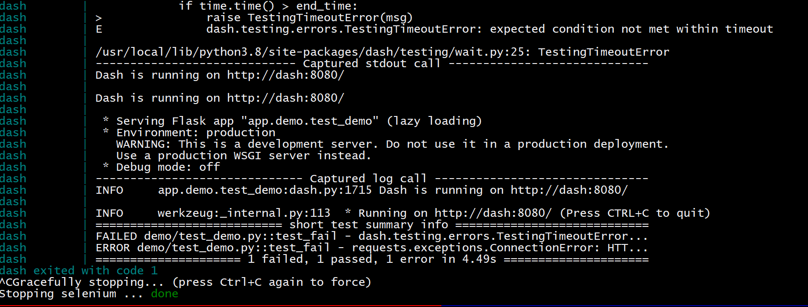

# Demo for plotly/dash PR#1548

## Requirements

- docker & docker-compose

## Usage

```bash
docker-compose up
```



## Explanation

There are 2 containers in the docker-compose file: `dash` which is a barebones instance of dash with an integration test, and `selenium` which is a stock Selenium instance that can be used for remote testing via commands to `http://selenium:4444` from inside the Docker network. 

There are 2 tests in `./app/demo/test_demo.py`. One (`test_fail`) spins up a `dash_duo` instance exactly how it is done at the [canonical example](https://dash.plotly.com/testing) with host set to `dash`, the hostname of the dash container (which is resolved by Docker DNS). This fails because even though the test service successfully starts and binds to `http://dash:8080`, the call to [wait_for_page](https://github.com/plotly/dash/blob/34b11194227783f326dbc77c50fb70638ddec357/dash/testing/browser.py#L602) tells Selenium to attempt to reach the test server at the hardcoded address of `http://localhost:8080`.

`test_success` on the other hand uses `ThreadedRunnerWrapper` which inherits from the stock `ThreadedRunner` and allows the user to specify the scheme and host that is communicated to the Selenium driver as the address of the test server. So intead of Selenium failing as above, it succeeds by running tests against `http://dash:8080`.

Accordingly, the output from the `dash` container shows 1 test fail and 1 succeed.
